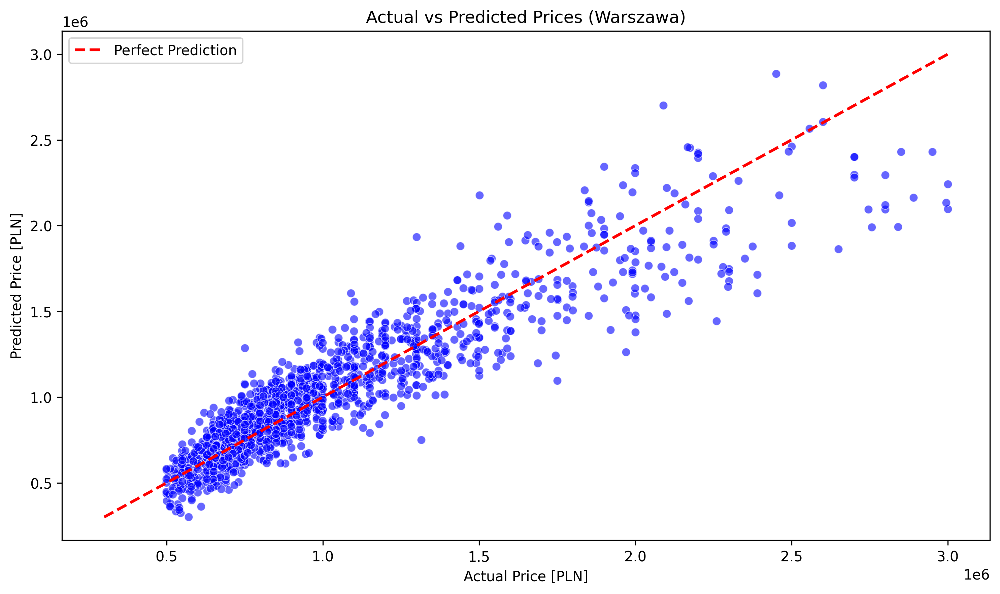
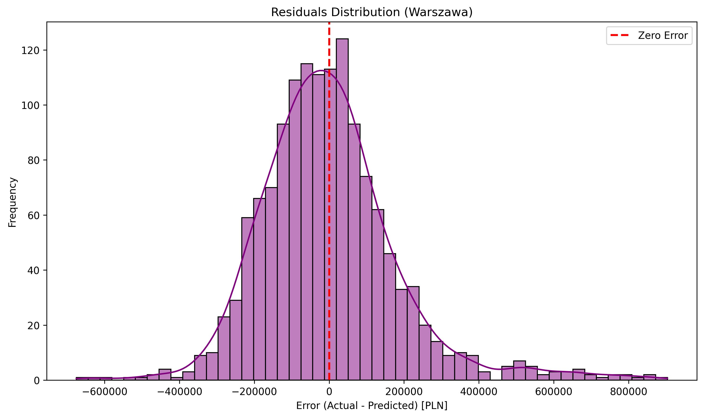
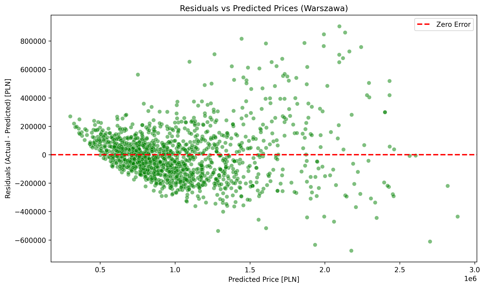

# Polish Apartment Prices Predictor

An end-to-end Machine Learning project aimed at researching and predicting apartment prices in Poland.

## Overview
This project provides a complete Machine Learning pipeline designed to predict apartment prices in major Polish cities (currently optimized and evaluated for **Warsaw**). It automatically fetches real estate data, cleans it, engineers new features, trains a Linear Regression model with K-Fold Cross-Validation, and saves the final model and scalers for future inference.

## Project Structure
- `data_loader.py`: Automatically downloads and caches the dataset from Kaggle (`krzysztofjamroz/apartment-prices-in-poland`) using `kagglehub`.
- `preprocess.py`: Handles missing values via smart imputation (based on city and building type), performs feature engineering (e.g., calculating building age, non-linear distance transformations), and applies One-Hot Encoding.
- `model.py`: Manages data splitting, feature scaling (`StandardScaler`), model training, 5-Fold cross-validation, and model persistence (saving/loading via `joblib`).
- `visualize.py`: Generates and saves diagnostic plots to evaluate model performance and check for heteroscedasticity.
- `main.py`: The orchestrator script that ties the entire pipeline together.
- `analisys.ipynb`: A Jupyter Notebook used for initial Exploratory Data Analysis (EDA).

## Model Performance (Warsaw)
Based on a 5-Fold Cross-Validation evaluating the Linear Regression model on the Warsaw real estate market, the pipeline achieved the following baseline metrics:
- **Average R²**: ~0.827 (Explains 82.7% of the variance in prices)
- **Average MAE**: ~138,200 PLN
- **Average RMSE**: ~194,500 PLN

### Key Price Drivers:
- **Increases Price**: Square Meters, Premium Condition, New Development (built $\ge$ 2015).
- **Decreases Price**: Distance from City Center, Block of Flats (*wielka płyta*).

## Visualizations & Insights

### Actual vs Predicted Prices

**Insight:** The model predicts prices accurately for standard apartments (up to ~1.5M PLN) where the data points tightly hug the red ideal prediction line. However, it tends to underpredict the prices of luxury, high-end real estate.

### Residuals Analysis

**Insight:** The error (residual) distribution is mostly normal and centered around zero, meaning the model is generally unbiased. However, the wider spread at the tails indicates occasional large prediction errors for outlier properties.


**Insight:** This plot reveals a classic case of **heteroscedasticity** (a "funnel" shape). As the predicted price increases, the spread of the errors grows significantly. This proves that Linear Regression struggles with the non-linear nature of premium real estate.

## How to Run
1. Clone this repository.
2. Ensure you have Python 3.x installed.
3. Install the required dependencies:
   ```bash
   pip install -r requirements.txt
   ```
4. Execute the main pipeline:
   ```bash
   python main.py
   ```
5. The script will fetch the data, process it, output performance metrics, generate visualizations, and save the ready-to-use model as `housing_model.joblib`.